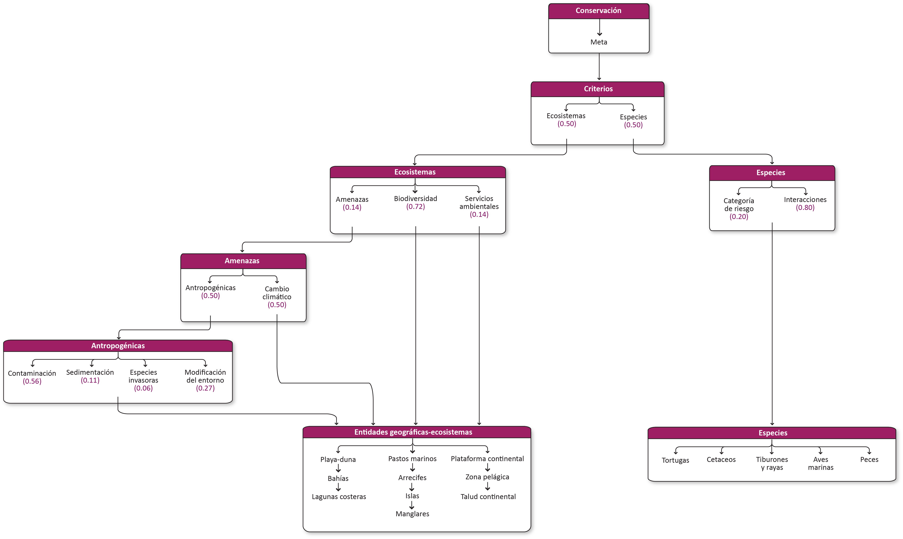
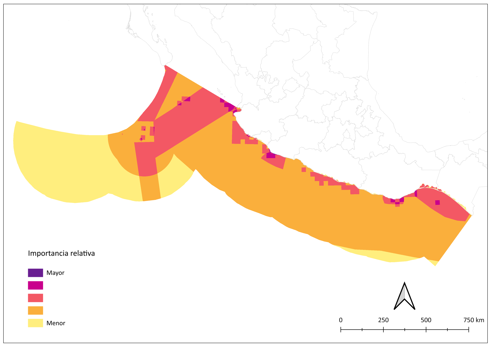
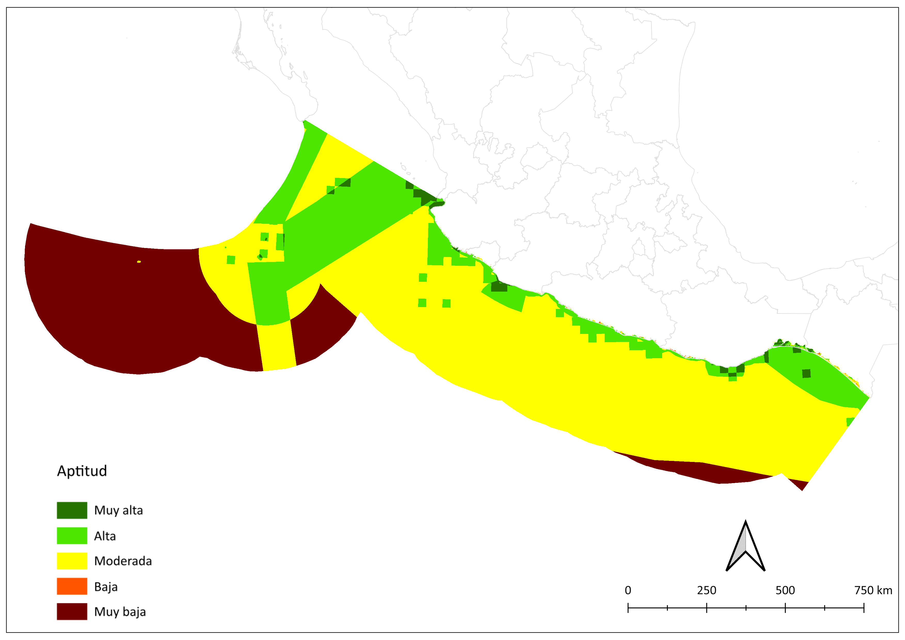
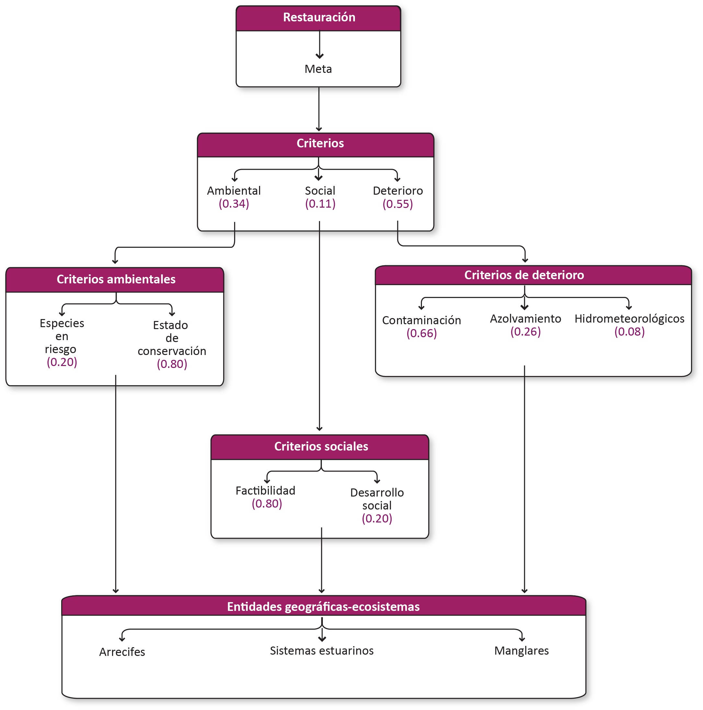
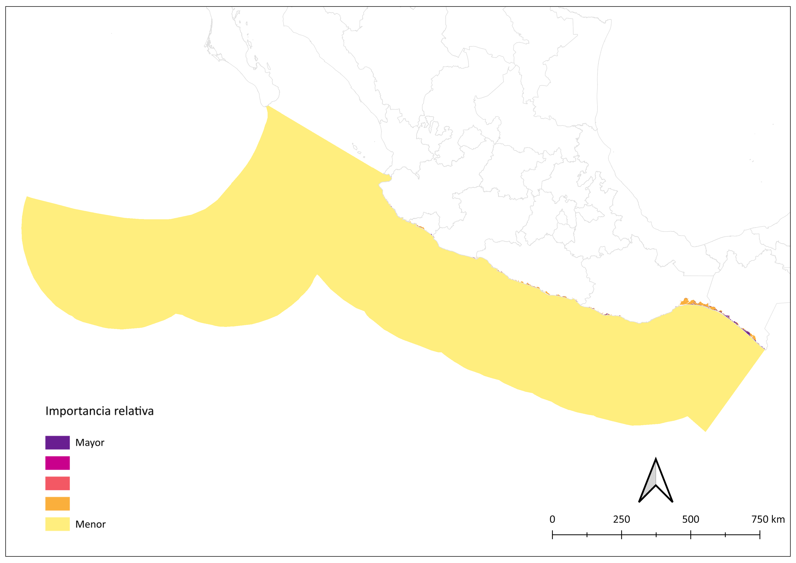
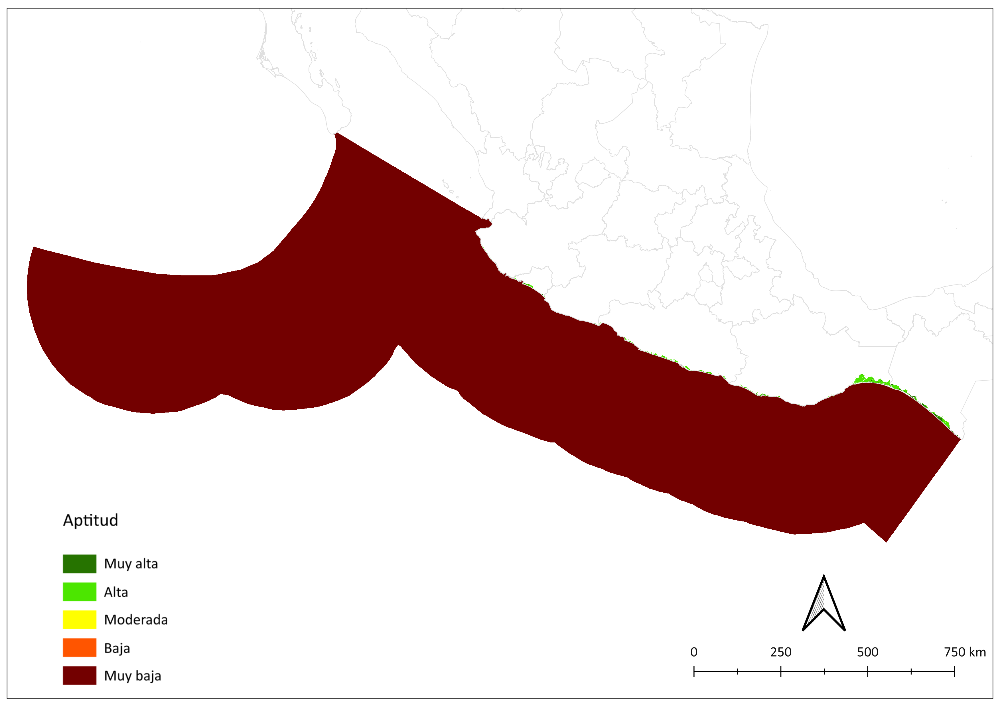

# Conservación. 

<!-- Ruta de la documentación:
FOMIX\fmx_estudio_tecnico\diagnostico\talleres\sphinx\docs -->

[Presentación](https://www.dropbox.com/scl/fi/dgxqlpk4xnlnyzhbrswy7/pp_talleres_oempcs_cons.pdf?rlkey=cisy416w0ob6n8tcqy9ff3s7d&st=h9k4z8kl&dl=0)

## Meta

El mantenimiento de procesos que garantizan la conservación y restauración de los ecosistemas marinos y costeros, su biodiversidad y los servicios ecosistémicos que prestan desde una perspectiva socio-ecológica, así como el incremento de la resiliencia ante el cambio climático de los ecosistemas y las comunidades costeras y el desarrollo sostenible de la región, a través de mecanismos de gobernanza. 
La perspectiva socio-ecológica debe integrar (1) el fortalecimiento de medios y modos de vida que son garantes del mantenimiento de los sistemas socio-ecológicos, (2) el índice de desarrollo humano, (3) la interacción entre conservación y economía, (4) las buenas prácticas ambientales y sociales, (5) la participación de las comunidades locales, indígenas y afromexicanas, (6) el registro y consideración de saberes, (7) la consideración del contexto sociocultural, (8) la seguridad alimentaria, (9) la justicia y (10) la perspectiva de género.

**Contar con la mejor información disponible** con propósito de definir unidades de conservación, para lo cual se deberán llevar a cabo investigación para la detección, caracterización y clasificación de hábitat marinos. 

**Fortalecer aspectos de la gobernanza,** incluyendo: (1) el cumplimiento de los acuerdos internacionales, (2) el decreto de nuevas ANP y la implementación de otros instrumentos de conservación, reservas de pesca comunitaria y sitios RAMSAR, (3) la vigilancia y las sanciones de los delitos ambientales, (4) el monitoreo de los ecosistemas, (5) la colaboración entre los 3 órdenes de gobierno, OSC, ciudadanía y academia, (6) la aplicación del principio precautorio, (7) el manejo integrado de cuencas y (8) la atención de los vacíos en el marco legal.

**Minimizar las amenazas a la biodiversidad** por diversos factores, que incluyen: (1) la mortalidad incidental de megafauna, (2) la contaminación, (3) la introducción de especies invasoras, (4) el desarrollo actividades no sostenibles (tránsito marítimo, pesca, minería, turismo, etc.) y los efectos del cambio climático.

[Lista de participantes](https://www.dropbox.com/scl/fi/rvp79f521tkus2wqgnm4n/lista_asistencia.pdf?rlkey=908278fuz4xhvnbbmhlo5uvog&st=9r36ylxj&dl=0)

## 1. Conservación

### 1.1 Modelo de decisión

### 1.2 Insumos

**Arrecifes**

Capa | Mexican Reefs Data

Fuente | Ortiz-Lozano, Leonardo; Santander-Monsalvo, Jacobo; espejel, ileana (2018), “Mexican Reefs Data”, Mendeley Data, V1, doi: 10.17632/dmfmv4b396.1

Año  | 2018

Escala | Sin dato

Variable | ID / Reef Name

Unidades | UTM WGS 84

**Bahías**

Capa |  Marco Geoestadístico municipal  2023

Fuente | INEGI

Año  | 2023

Escala | 1:250000

Variable |

Unidades | Adimensional

Liga |

**Islas**

Capa | Línea de Costa de México en función del relieve 2023

Fuente | INEGI

Año  | 2024

Escala |

Variable |

Unidades | ITRF92

Liga | Publicaciones y mapas

**Manglar**

Capa | Distribución de manglares  y manglares perturbados en México 2020

Fuente | CONABIO

Año  | 2020

Escala | 1: 50,000

Variable |

Unidades | Adimensional

Liga |

**Zona pelágica, plataforma y talud continental**

Capa | Geomorfología marina

Fuente | Lugo-Hubp, José., Córdova, Carlos-Fernández, Arteaga. (1990)

Año  | 1990

Escala | 1:4000000

Variable | Geomor_Mar

Unidades | Adimensional

Liga | http://www.conabio.gob.mx/informacion/gis/?vns=gis_root/topog/marino/geom4mgw

**Aves**

Capa |

Fuente | CIPAMEX (CONABIO), (17/07/2015). 'Áreas de importancia para la conservación de las aves, 2015', escala: 1:250000. Sección Mexicana del Consejo Internacional para la Preservación de las Aves. Financiado por CONABIO-FMCN-CCA. Comisión Nacional para el Conocimiento y Uso de la Biodiversidad, México, D.F.. México, D.F..

Año  | 2015

Escala | 1:250000

Variable |

Unidades |

Liga | http://www.conabio.gob.mx/informacion/gis/?vns=gis_root/region/biotic/aicas15gw

<!-- Capa | Conjunto de datos vectoriales de uso del suelo y vegetación serie VII

Fuente | Instituto Nacional de Estadística y Geografía (INEGI)

Año  | 2018

Escala | 1:250 000

Variable | USOVEG : VEGETACIÓN DE DUNAS COSTERAS

Unidades | Adimensional

Liga | -->

**Cetáceos**

Capa | Avistamiento de cetáceos - áreas de distribución espacial relativa

Fuente | Luis Medrano,

Año  | 1981 - 2019

Escala | 0.25° x 0.25°

Variable |  Adimensional

Unidades |

Liga |

**Tortugas**

Capa | Especies amenazadas de preocupación común, 2008

Fuente | CommonConservartion Concern, 2008

Año  | 2008

Escala | S/N

Variable | Green turtle / Kemp’s ridley turtle / Leatherback turtle / Loggerhead turtle

Unidades | EPSG: 2163 US National Atlas Equal Area (metros)

Liga | http://www.cec.org/es/atlas-ambiental-de-america-del-norte/especies-marinas-amenazadas-de-preocupacion-comun/

**Tiburones y rayas**

Capa |

Fuente | IUCN SSC Shark Specialist Group. 2023. Gulf of California-Revillagigedo-Clipperton Migration Corridor ISRA Factsheet. Dubai: IUCN SSC Shark Specialist Group.

Año  | 2023

Escala |

Variable |

Unidades |

Liga |

**Peces**

Capa | Base de datos de sitios de observación de peces

Fuente | Georgina Ramirez

Año  | 1984 - 2022

Escala | Sin dato

Variable |

Unidades | Adimensional

Liga |

### 1.2 Criterios

#### 1.3.1 Criterios de evaluación de ecosistemas
##### 1.3.1.1 Biodiversidad 

Importancia relativa de las entidades cartográficas o ecosistemas marinos y costeros respecto a su diversidad de especies.

**Parámetros para la función de valor**

| Entidades geográficas - ecosistemas | Importancia | Valor |
|-------------------------------------|-------------|-------|
| Islas                               | Alta        | 0.75  |
| Arrecife                            | Muy alta    | 1.00  |
| Lagunas costeras                    | Alta        | 0.75  |
| Playa-dunas                         | Moderada    | 0.5   |
| Manglares                           | Muy alta    | 1.00  |
| Pastos marinos                      | Moderada    | 0.5   |
| Bahías                              | Alta        | 0.75  |
| Plataforma continental              | Alta        | 0.75  |
| Zona Pelágica                       | Moderada    | 0.5   |
| Talud continental                   | Moderada    | 0.5   |

**Función de valor de Biodiversidad**

##### 1.3.1.2 Servicios ambientales

Importancia relativa de las entidades cartográficas o ecosistemas marinos y costeros respecto a los servicios ambientales de provisión, regulación, culturales y soporte que prestan.

**Parámetros para la función de valor**

| Entidades geográficas - ecosistemas | Importancia | Valor |
|-------------------------------------|-------------|-------|
| Islas                               | Moderada    | 0.50  |
| Arrecife                            | Muy alta    | 1.00  |
| Lagunas costeras                    | Alta        | 0.75  |
| Playa-dunas                         | Alta        | 0.75  |
| Manglares                           | Muy alta    | 1.00  |
| Pastos marinos                      | Moderada    | 0.50  |
| Bahías                              | Alta        | 0.75  |
| Plataforma continental              | Moderada    | 0.50  |
| Zona Pelágica                       | Moderada    | 0.50  |
| Talud continental                   | Moderada    | 0.50  |

**Función de valor de Servicios ambientales**

##### 1.3.1.3 Amenazas

###### 1.3.1.3.1 Cambio climático 

Importancia relativa de las entidades cartográficas o ecosistemas marinos y costeros respecto a las amenazas derivadas de los efectos del cambio climático, incluyendo (1) el aumento en el número e intensidad de las tormentas, (2) aumento en el nivel del mar, (3) aumentos en la temperatura del mar, (4) aumento en la acidificación, (5) cambios en corrientes, (6) cambios en la línea de costa, (7) cambios en la productividad y (8) cambios en la sedimentación biogénica.

**Parámetros para la función de valor**

| Entidades geográficas - ecosistemas | Importancia | Valor |
|-------------------------------------|-------------|-------|
| Islas                               | Alta        | 0.75  |
| Arrecife                            | Muy alta    | 1.00  |
| Lagunas costeras                    | Alta        | 0.75  |
| Playa-dunas                         | Alta        | 0.75  |
| Manglares                           | Muy alta    | 1.00  |
| Pastos marinos                      | Moderada    | 0.50  |
| Bahías                              | Alta        | 0.75  |
| Plataforma continental              | Moderada    | 0.50  |
| Zona Pelágica                       | Moderada    | 0.50  |
| Talud continental                   | Moderada    | 0.50  |

**Mapa función de valor de Cambio climático**

###### 1.3.1.3.1 Antropogénicas

1.3.1.3.1.1 Contaminación 

Importancia relativa de las entidades cartográficas o ecosistemas marinos y costeros respecto a las amenazas derivadas del ingreso de elementos físicos, químicos o biológicos que 
causan desequilibrio ecológico o degradación.

**Parámetros para la función de valor**

| Entidades geográficas - ecosistemas | Importancia | Valor |
|-------------------------------------|-------------|-------|
| Islas                               | Moderada    | 0.50  |
| Arrecife                            | Muy alta    | 1.00  |
| Lagunas costeras                    | Muy alta    | 1.00  |
| Playa-dunas                         | Alta        | 0.75  |
| Manglares                           | Muy alta    | 1.00  |
| Pastos marinos                      | Moderada    | 0.50  |
| Bahías                              | Alta        | 0.75  |
| Plataforma continental              | Moderada    | 0.50  |
| Zona Pelágica                       | Moderada    | 0.50  |
| Talud continental                   | Moderada    | 0.50  |

**Función de valor de Contaminación**

1.3.1.3.1.2 Sedimentación 

Importancia relativa de las entidades cartográficas o ecosistemas marinos y costeros respecto a las amenazas derivadas del aporte de sedimentos por efecto de actividades humanas en 
la costa provocada por la deforestación, erosión por desarrollo de infraestructura, entre otros.

**Parámetros para la función de valor**

| Entidades geográficas - ecosistemas | Importancia | Valor |
|-------------------------------------|-------------|-------|
| Islas                               | Moderada    | 0.50  |
| Arrecife                            | Muy alta    | 1.00  |
| Lagunas costeras                    | Muy alta    | 1.00  |
| Playa-dunas                         | Alta        | 0.75  |
| Manglares                           | Alta        | 0.75  |
| Pastos marinos                      | Alta        | 0.75  |
| Bahías                              | Alta        | 0.75  |
| Plataforma continental              | Moderada    | 0.50  |
| Zona Pelágica                       | Moderada    | 0.50  |
| Talud continental                   | Baja        | 0.25  |

**Función de valor de Sedimentación**

1.3.1.3.1.3 Modificación del entorno 

Importancia relativa de las entidades cartográficas o ecosistemas marinos y costeros respecto a las amenazas derivadas de modificaciones por cambios de uso de suelo, relleno de áreas
inundables, ganancia de terreno al mar, fractura de estructuras arrecifales, formación de canales, modificaciones en patrones de infiltración, cambios en la línea de costa, efectos 
de la minería, entre otros.

**Parámetros para la función de valor**

| Entidades geográficas - ecosistemas | Importancia | Valor |
|-------------------------------------|-------------|-------|
| Islas                               | Moderada    | 0.50  |
| Arrecife                            | Muy alta    | 1.00  |
| Lagunas costeras                    | Muy alta    | 1.00  |
| Playa-dunas                         | Alta        | 0.75  |
| Manglares                           | Muy alta    | 1.00  |
| Pastos marinos                      | Moderada    | 0.50  |
| Bahías                              | Alta        | 0.75  |
| Plataforma continental              | Moderada    | 0.50  |
| Zona Pelágica                       | Moderada    | 0.50  |
| Talud continental                   | Baja        | 0.25  |

**Función de valor de Modificación del entorno**

1.3.1.3.1.4 Especies invasoras 

Importancia relativa de las entidades cartográficas o ecosistemas marinos y costeros respecto a las amenazas derivadas de la introducción de especies exóticas que causan daños al 
ecosistema, a las especies nativas, a la salud o a la economía.

**Parámetros para la función de valor**

| Entidades geográficas - ecosistemas | Importancia | Valor |
|-------------------------------------|-------------|-------|
| Islas                               | Alta        | 0.75  |
| Arrecife                            | Muy alta    | 1.00  |
| Lagunas costeras                    | Muy alta    | 1.00  |
| Playa-dunas                         | Moderada    | 0.50  |
| Manglares                           | Alta        | 0.75  |
| Pastos marinos                      | Baja        | 0.25  |
| Bahías                              | Alta        | 0.75  |
| Plataforma continental              | Moderada    | 0.50  |
| Zona Pelágica                       | Moderada    | 0.50  |
| Talud continental                   | Baja        | 0.25  |

**Función de valor de Especies invasoras**

#### 1.3.2 Criterios de evaluación de especies

##### 1.3.2.1 Categoría de riesgo 

Importancia relativa de taxa prioritarios (tiburones y rayas, tortugas marinas, aves marinas, peces y cetáceos) respecto a su estatus de riesgo de extinción.

**Parámetros para la función de valor**

| Especies          | Importancia | Valor |
|-------------------|-------------|-------|
| Aves marinas      | Moderada    | 0.50  |
| Cetáceos          | Alta        | 0.75  |
| Tortugas          | Alta        | 0.75  |
| Tiburones y rayas | Alta        | 0.75  |
| Peces             | Moderada    | 0.50  |

**Función de valor de Categoría de riesgo**

##### 1.3.2.2 Interacciones 

Importancia relativa de taxa prioritarios (tiburones y rayas, tortugas marinas, aves marinas, peces y cetáceos) respecto amenazas derivadas de interacciones con actividades 
productivas, incluyendo pesca incidental, colisiones con embarcaciones, sobrepesca.

**Parámetros para la función de valor**

| Especies          | Importancia | Valor |
|-------------------|-------------|-------|
| Aves marinas      | Moderada    | 0.50  |
| Cetáceos          | Alta        | 0.75  |
| Tortugas          | Alta        | 0.75  |
| Tiburones y rayas | Alta        | 0.75  |
| Peces             | Alta        | 0.75  |

**Función de valor de Interacciones**

### 1.4 Mapa de aptitud objetivo de conservación

## 2. Restauración

### 2.1 Modelo de decisión

### 2.2 Insumos

### 2.3	Criterios 

#### 2.3.1 Criterios de deterioro 

##### 2.3.1.1 Contaminación 

Importancia relativa de los ecosistemas marinos y costeros para su restauración, respecto al deterioro provocado por la contaminación.

**Parámetros para la función de valor**

| Entidades geográficas - ecosistemas | Importancia | Valor |
|-------------------------------------|-------------|-------|
| Arrecife                            | Alta        | 0.75  |
| Manglares                           | Alta        | 0.75  |
| Sistemas estuarinos                 | Muy alta    | 1.00  |

**Función de valor de Contaminación**

##### 2.3.1.2 Azolvamiento 

Importancia relativa de los ecosistemas marinos y costeros para su restauración, respecto al deterioro provocado por el azolvamiento.

**Parámetros para la función de valor**

| Entidades geográficas - ecosistemas | Importancia | Valor |
|-------------------------------------|-------------|-------|
| Arrecife                            | Alta        | 0.75  |
| Manglares                           | Alta        | 0.75  |
| Sistemas estuarinos                 | Muy alta    | 1.00  |

**Función de valor de Azolvamiento**

##### 2.3.1.3 Eventos hidrometeorológicos 

Importancia relativa de los ecosistemas marinos y costeros para su restauración, respecto al deterioro provocado por eventos hidrometeorológicos extremos.

**Parámetros para la función de valor**

| Entidades geográficas - ecosistemas | Importancia | Valor |
|-------------------------------------|-------------|-------|
| Arrecife                            | Alta        | 0.75  |
| Manglares                           | Alta        | 0.75  |
| Sistemas estuarinos                 | Moderada    | 0.5   |

**Función de valor de Eventos hidrometeorológicos**

#### 2.3.2 Criterios ambientales

##### 2.3.2.1 Estado de conservación 

Importancia relativa de los ecosistemas marinos y costeros para su restauración, respecto a la integridad de su estructura y funciones.

**Parámetros para la función de valor**

| Entidades geográficas - ecosistemas | Importancia | Valor |
|-------------------------------------|-------------|-------|
| Arrecife                            | Alta        | 0.75  |
| Manglares                           | Muy alta    | 1.00  |
| Sistemas estuarinos                 | Alta        | 0.75  |

**Función de valor de Estado de conservación**

##### 2.2.2.2 Especies en riesgo 

Importancia relativa de los ecosistemas marinos y costeros para su restauración, respecto a la proporción de especies en riesgo de extinción.

**Parámetros para la función de valor**

| Entidades geográficas - ecosistemas | Importancia | Valor |
|-------------------------------------|-------------|-------|
| Arrecife                            | Muy alta    | 1.00  |
| Manglares                           | Muy alta    | 1.00  |
| Sistemas estuarinos                 | Alta        | 0.75  |

**Función de valor de Especies en riesgo**

#### 2.3.3 Criterios sociales

##### 2.3.3.1 Factibilidad de restauración 

Importancia relativa de los ecosistemas marinos y costeros para su restauración, respecto a la viabilidad de su restablecimiento de forma efectiva.

**Parámetros para la función de valor**

| Entidades geográficas - ecosistemas | Importancia | Valor |
|-------------------------------------|-------------|-------|
| Arrecife                            | Moderada    | 0.5   |
| Manglares                           | Muy alta    | 1.00  |
| Sistemas estuarinos                 | Moderada    | 0.5   |

**Función de valor de Factibilidad de restauración**

##### 2.3.3.2 Desarrollo social 

Importancia relativa de los ecosistemas marinos y costeros para su restauración, respecto a las condiciones económicas y de organización de las comunidades marginadas que dependen de
esos ecosistemas.

**Parámetros para la función de valor**

| Entidades geográficas - ecosistemas | Importancia | Valor |
|-------------------------------------|-------------|-------|
| Arrecife                            | Alta        | 0.75  |
| Manglares                           | Muy alta    | 1.00  |
| Sistemas estuarinos                 | Alta        | 0.75  |

**Función de valor de Desarrollo social**

### 2.3 Mapa de aptitud objetivo de restauración

<!--### 1.2 Criterios

**Insumos**

Capa | Recarga del acuífero
-- | --
Fuente | Recarga promedio 2004-2008. Batllori Sampedro, E. y Canto Mendiburu, S
Año | Sin dato
Escala | Sin dato
Unidades | Milímetros

**Parámetros de la función de valor**

ID | Categoría | Importancia | FV
-- | -- | -- | --
8 | 500 | Muy alta | 1.00
7 | 400 | Alta | 0.75
6 | 300 | Moderada | 0.50
4 | 100 | Baja | 0.25
1 | -300 | Nula | 0.00
2 | -500 | Nula | 0.00

**Función de valor de zonas de recarga**

### 1.3 Mapa de aptitud

#### 1.3.1 Mapa de aptitud de servicios ambientales de soporte

#### 1.3.2 Mapa de aptitud de servicios ambientales de regulación

#### 1.3.3 Mapa de aptitud de servicios ambientales de provisión

#### 1.3.4 Mapa de aptitud de servicios ambientales culturales

#### 1.3.5 Mapa de aptitud de funcionalidad ecosistémica

#### 1.3.6 Mapa de aptitud de conservación

##### 1.3.6.1 Zonas de aprovechamiento actual de conservación

**Insumos**

Capa | Áreas Naturales Protegidas
-- | --
Fuente | [1] Áreas Naturales Protegidas SDS con datos de los decretos de las ANPs estatales, [2] Áreas Naturales Protegidas Federales de la República Mexicana CONANP y [3] Áreas Naturales Protegidas Estatales, Municipales, Ejidales y Privadas de México CONABIO
Año | [1] 2020; [2] 2017; [3] 2015
Escala | [1] 1:50,000; [2] [3] Sin dato
Unidades | Adimensional

##### 1.3.6.2 Zonas de exclusión

Se utilizaron todas las localidades (urbanas y rurales).

**Insumos**

Capa | Localidades
-- | --
Fuente | Polígonos de localidades. Marco Geoestadístico. Censo de Población y   Vivienda INEGI
Año | 2020
Escala | Localidad
Unidades | Adimensional

##### 1.3.6.3 Mapa de aptitud de conservación

**Pesos globales de los atributos del sector conservación**

Criterio | Subcriterio | Peso
-- | -- | --
Fragilidad ecosistémica | Integridad ecológica | 0.136
Regulación | Cobertura forestal | 0.112
Soporte | Zonas de recarga | 0.087
Vulnerabilidad hídrica | Vulnerabilidad intrínseca | 0.075
Fragilidad kárstica | Densidad de dolinas | 0.074
Soporte | Cobertura forestal | 0.065
Vulnerabilidad hídrica | Zonas de recarga | 0.061
Provisión | Cobertura | 0.055
Regulación | Captura de carbono | 0.050
Fragilidad ecosistémica | Distancia a ANP y sitios Ramsar | 0.046
Soporte | Riqueza forestal | 0.030
Vulnerabilidad hídrica | Humedales | 0.025
Fragilidad kárstica | Cenotes | 0.025
Vulnerabilidad hídrica | Cenotes | 0.024
Fragilidad ecosistémica | AICAS | 0.021
Provisión | Cuerpos de agua | 0.018
Provisión | Parientes silvestres de cultivo | 0.018
Regulación | Especies melíferas | 0.016
Soporte | Biomasa aérea | 0.016
Vulnerabilidad hídrica | Reforestación | 0.013
Culturales - biofísicos sociales | Cenotes y grutas | 0.008
Culturales - biofísicos sociales | Población indígena | 0.008
Culturales - biofísicos sociales | Zonas arqueológicas | 0.008
Culturales - político administrativo | ANP bioculturales | 0.002
Culturales - político administrativo | ADVC | 0.002
Culturales - político administrativo | Áreas de uso común | 0.001
Culturales - político administrativo | UMA | 0.001
Culturales - político administrativo | PSA | 0.001

**Área por categoría de aptitud**

Categoría | km² | Porcentaje del estado
-- | --: | --:
Muy alta | 10218.5 | 26
Alta | 13326.4 | 34
Moderada | 7518.1 | 19
Baja | 7043.7 | 18
Muy baja | 537.0 | 1
Nula | 893.0 | 2

#### 1.3.7 Sensibilidad de atributos ambientales del sector conservación

#### 1.3.8 Mapa de aptitud insumo para el modelo de ordenamiento

 -->
