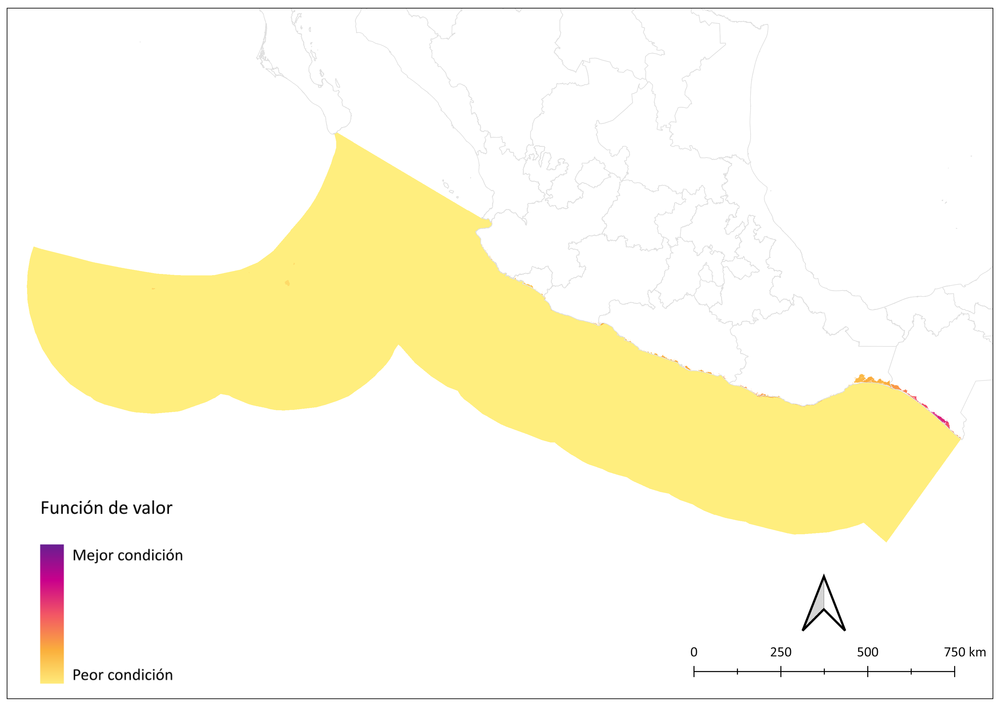

# Energía. Avances preliminares.

<!-- Ruta de la documentación:
PACA\diagno\aptitud\web\PACA\docs\source -->

## Meta

Aprovechar la energía liberada en el proceso espontáneo de mezclado entre dos soluciones de diferente concentración de sal que se pueden encontrar en desembocaduras de ríos, estuarios y lagunas o mediante el uso de agua con alta salinidad obtenida como un subproducto de un proceso industrial, principalmente mediante procesos de intercambio iónico o procesos osmóticos.

[Lista de participantes](https://www.dropbox.com/scl/fi/dt3zgq1tgm93t0agdd8rs/lista_asistencia.pdf?rlkey=eukuan69va4gzx66fed8rrtxs&st=0gpmghfg&dl=0)

## 1. Energía por gradiente salino

Fuentes de energía a escala.

### 1.1 Meta

Generar energía eléctrica a partir del proceso espontáneo de mezclado entre dos soluciones de diferente concentración de sal que ocurre naturalmente en desembocaduras de ríos, estuarios y lagunas o artificialmente, utilizando subproductos hipersalinos de procesos industriales.

### 1.2 Modelo de decisión

### 1.3 Gradiente salino

Criterios | Definición
-- | --
Gradiente industrial  | Disponibilidad de agua con alta salinidad a partir de un subproducto del proceso industrial
Gradiente natural | Disponibilidad de agua con alta salinidad a partir de procesos naturales

#### 1.3.1 Gradiente industrial

Disponibilidad de agua con alta salinidad a partir de un subproducto del proceso industrial.

Atributo | Definición
-- | --
Plantas desalinizadoras  | Distancia a las plantas desalinizadoras

##### 1.3.1.1 Plantas desalinizadoras

Distancia a las plantas desalinizadoras

#### 1.3.2 Gradiente natural

Disponibilidad de agua con alta salinidad a partir de procesos naturales

Criterio| Definición
-- | --
Evaporación | Grado de salinidad en la laguna por evaporación
Flujo |  Gradiente de salinidad por el aporte de agua dulce hacia el mar

##### 1.3.2.1 Evaporación

Grado de salinidad en la laguna por evaporación.

**Insumos**

Capa |[1]Mapa de uso del suelo y vegetación de la zona costera asociada a los manglares de México en 2020 [2]sitios de manglar con relevancia biológica y con necesidades de rehabilitación ecológica [3]Estadísticas del agua en México 2021
-- | --
Fuente |  [1 y 2] Comisión Nacional para el Conocimiento y Uso de la Biodiversidad [3] CONAGUA
Año  | [1] 2020 [2] 2009 [2]2020
Escala | [1 y 2]1:50000
Variable | [3] hm3/año
Unidades | Adimensional
Liga | Portal de Información Geográfica - CONABIO

**Parámetros para la función de valor**

| Categoría                                           | Importancia | Valor |
|-----------------------------------------------------|-------------|-------|
| ND                                                  | Nula        | 0     |
| Barra de Tecoanapa (Desembocadura del Río Ometepec) | Baja        | 0.25  |
| Boca de Pantla                                      | Nula        | 0     |
| Boca del Río de la Unión                            | Nula        | 0     |
| Chacahua-Pastoría                                   | Nula        | 0     |
| Chantecuan                                          | Nula        | 0     |
| Coyuca-Mitla                                        | Baja        | 0.25  |
| Ixtapa                                              | Nula        | 0     |
| La Encrucijada                                      | Baja        | 0.25  |
| La Joya                                             | Moderada    | 0.5   |
| Laguna Barra de Navidad                             | Nula        | 0     |
| Laguna Chalacatepec                                 | Nula        | 0     |
| Laguna El Caimán                                    | Nula        | 0     |
| Laguna El Potosí                                    | Baja        | 0.25  |
| Laguna de Cuyutlán                                  | Baja        | 0.25  |
| Lagunas Cabildo-Amatal-Gancho Murillo               | Baja        | 0.25  |
| Los Patos Solo Dios                                 | Moderada    | 0.5   |
| Mar Muerto                                          | Moderada    | 0.5   |
| Sistema Chamela-Cuixmala                            | Nula        | 0     |
| Sistema Lagunar Estuarino Agua Dulce-El Ermitaño    | Nula        | 0     |
| Sistema Lagunar Huave                               | Moderada    | 0.5   |

**Función de valor**

##### 1.3.2.2 Flujo

Gradiente de salinidad por el aporte de agua dulce hacia el mar

Criterio| Definición
-- | --
Descarga | Volumen de agua dulce por unidad de tiempo que llega al mar
Precipitación |  Precipitación anual promedio (mm) del período de 1910 a 2009

###### 1.3.2.2.1 Descarga

Volumen de agua dulce por unidad de tiempo que llega al mar.

**Insumos**

Capa |[1] Rios principales [2] Estadísticas del agua en México 2021
-- | -
Fuente | [1] SISTEMA NACIONAL DE INFORMACIÓN DEL AGUA 3.0 CONAGUA   [2] CONAGUA
Año  |[ 1] 2023 [2] 2022
Escala | Sin dato
Variable |  [2] Escurrimiento natural medio superficial
Unidades | [1] Adimensional, [2]hm3/año
Liga |

**Parámetros para la función de valor**

| Categoría              | Importancia | Valor  |
|------------------------|-------------|--------|
| ND                     | Muy baja    | 0      |
| Ameca - 2289 hm3       | Moderada    | 0.25   |
| Armería - 1760 hm3     | Baja        | 0.125  |
| Balsas - 18140 hm3     | Muy alta    | 1      |
| Coahuayana - 1671 hm3  | Baja        | 0.125  |
| Coatán - 745 hm3       | Muy baja    | 0.0625 |
| Marabasco - 500 hm3    | Muy baja    | 0.0625 |
| Ometepec - 5115 hm3    | Alta        | 0.5    |
| Papagayo - 4650 hm3    | Alta        | 0.5    |
| San Nicolás - 442 hm3  | Muy baja    | 0.0625 |
| Tehuantepec - 1410 hm3 | Baja        | 0.125  |
| Tomatlán - 1171 hm3    | Baja        | 0.125  |
| Verde - 6006 hm3       | Alta        | 0.5    |

**Función de valor**

###### 1.3.2.2.2 Precipitación

Precipitación anual promedio (mm) del período de 1910 a 2009

**Insumos**

Capa | Precipitación anual en México (1910-2009)
-- | --
Fuente | Cuervo-Robayo, A. P., Téllez-Valdés, O., Gómez-Albores, M. A., Venegas-Barrera, C. S., Manjarrez, J., Martínez-Meyer, E.,
Año  | 2014
Escala |  1:1000000
Variable | PANUAL
Unidades | mm
Liga | Portal de Información Geográfica - CONABIO

**Parámetros para la función de valor**

**Función de valor**

### 1.4 Mapa de aptitud de energía por gradiente salino

## 2. Energía por gradiente térmico

## 2.1 Meta

Generar energía eléctrica a partir de las diferencias de temperatura mayores o iguales a 20 °C entre el agua superficial del mar y el agua a diferentes profundidades (entre 500 y 1000 metros) para obtener energía eléctrica, mediante la tecnología de Conversión de Energía Térmica Oceánica.

El mapa de aptitud se basa en el trabajo realizado por los miembros del Centro Mexicano de Innovación en Energía Océano (CEMIE-Océano https://cemieoceano.mx/) para la identificación del potencial de generación de energías en el océano.

**Insumos**

Capa | Distribución Espacial del Recurso Energético por Gradiente Térmico en los Mares Mexicanos
-- | --
Fuente |  Cemie-Océano, Universidad Autónoma de Campeche
Año  |  2020
Escala | Sin dato
Variable |   Pixeles
Unidades | MWe
Liga |

**Función de valor**

### 2.2 Mapa de aptitud de energía por gradiente térmico

<!-- ##### 1.2.1.1 Carreteras

Distancia a carreteras.

**Insumos**

Capa | Distancia a carreteras
-- | --
Fuente | Red Nacional de Caminos (RNC) Red vial - INEGI
Año | 2019
Escala | Sin dato
Unidades | Kilómetros

**Parámetros de la función de valor**

  

**Función de valor de carreteras**

 -->

#### 1.2.2 Gradiente natural

Disponibilidad de agua con alta salinidad a partir de procesos naturales

Subcriterio| Definición
-- | --
Evaporación | Grado de salinidad en la laguna por evaporación
Flujo |  Gradiente de salinidad por el aporte de agua dulce hacia el mar

##### 1.2.2.1 Flujo

Gradiente de salinidad por el aporte de agua dulce hacia el mar.

Subcriterio| Definición
-- | --
Descarga | Volumen de agua dulce por unidad de tiempo que llega al mar
Precipitación |  Precipitación anual promedio (mm) del período de 1910 a 2009

<!-- **Insumos**

 Campo | Uso del suelo y vegetación
-- | --
Fuente | [1] Conjunto de datos vectoriales de la carta de Uso del suelo y vegetación. Serie VI. Conjunto Nacional INEGI y [2] Mapa de uso del suelo y vegetación de la zona costera asociada a los manglares, Región Península de Yucatán CONABIO
Año | [1] 2017; [2] 2021
Campo | [1] descripcio; [2] Descrip
Escala | [1] 1:250,000; [2] 1:50,000
Unidades | Adimensional

**Parámetros de la función de valor**

ID | Categoría | Importancia | FV
-- | -- | -- | --
2 | Agricultura de riego | Máxima | 1.00
3 | Agricultura de temporal | Máxima | 1.00
5 | Bosque cultivado/Palmar inducido | Máxima | 1.00
8 | Pastizal | Máxima | 1.00
11 | Sin vegetación | Máxima | 1.00
4 | Asentamiento humano | Moderada | 0.70
9 | Selva baja | Baja | 0.56
10 | Selva mediana | Baja | 0.56
12 | Sabana | Muy baja | 0.33
1 | Acuícola | Nula | 0.00
6 | Cuerpo de agua | Nula | 0.00
7 | Manglar | Nula | 0.00
13 | Tular | Nula | 0.00
14 | Vegetación de duna costera | Nula | 0.00
15 | Vegetación de petén | Nula | 0.00
16 | Vegetación halófila hidrófila | Nula | 0.00
17 | ND | Nula | 0.00

**Función de valor de cobertura**

### 1.3 Mapa de aptitud

#### 1.3.1 Mapa de aptitud de fuente hidrocarburos líquidos

##### 1.3.1.1 Zonas de aprovechamiento actual de hidrocarburos líquidos

**Insumos**

Capa | Poliducto Progreso - Mérida y centrales eléctricas de combustóleo
-- | --
Fuente | [1] Infraestructura Nacional de Almacenamiento y Transporte por Ducto de Petrolíferos y [2] Mapas de Infraestructura Energética y Recursos Renovables SENER
Año | [1] ?; [2] 2016
Escala | [1] ?; [2] Sin dato
Unidades | Adimensional

##### 1.3.1.2 Zonas de exclusión actual de hidrocarburos líquidos

**Insumos**

Campo | Uso del suelo y vegetación
-- | --
Fuente | [1] Conjunto de datos vectoriales de la carta de Uso del suelo y vegetación. Serie VI. Conjunto Nacional INEGI y [2] Mapa de uso del suelo y vegetación de la zona costera asociada a los manglares, Región Península de Yucatán CONABIO
Año | [1] 2017; [2] 2021
Campo | [1] descripcio; [2] Descrip
Escala | [1] 1:250,000; [2] 1:50,000
Unidades | Adimensional

**Tabla de exclusión del sector energía de fuente hidrocarburos líquidos**

ID | Cobertura
-- | --
1 | Acuícola
4 | Asentamiento humano
6 | Cuerpo de agua
7 | Manglar
13 | Tular
14 | Vegetación de duna costera
16 | Vegetación halófila hidrófila
17 | ND

##### 1.3.1.3 Mapa de aptitud de energía de fuente hidrocarburos líquidos

#### 1.3.2 Mapa de aptitud de fuente gas natural

##### 1.3.2.1 Zonas de aprovechamiento actual de gas natural

**Insumos**

Capa | [1] Centrales eléctricas de gas; [2] Gasoducto
-- | --
Fuente | [1] Mapas de Infraestructura Energética y Recursos Renovables SENER; [2] Gasoductos GeoComunes con datos de CRE, SEMARNAT, ASEA y CFE
Año | [1] 2016; [2] 2020
Escala | Sin dato
Unidades | Adimensional

##### 1.3.2.2 Zonas de exclusión actual de gas natural

**Insumos**

Campo | Uso del suelo y vegetación
-- | --
Fuente | [1] Conjunto de datos vectoriales de la carta de Uso del suelo y vegetación. Serie VI. Conjunto Nacional INEGI y [2] Mapa de uso del suelo y vegetación de la zona costera asociada a los manglares, Región Península de Yucatán CONABIO
Año | [1] 2017; [2] 2021
Campo | [1] descripcio; [2] Descrip
Escala | [1] 1:250,000; [2] 1:50,000
Unidades | Adimensional

**Tabla de exclusión del sector energía de fuente gas natural**

ID | Cobertura
-- | --
1 | Acuícola
4 | Asentamiento humano
6 | Cuerpo de agua
7 | Manglar
13 | Tular
14 | Vegetación de duna costera
16 | Vegetación halófila hidrófila
17 | ND

##### 1.3.2.3 Mapa de aptitud de energía de fuente gas natural

#### 1.3.8 Mapa de aptitud de energía

**Pesos globales de los atributos del sector energía**

Fuente de energía | Criterio | Peso
-- | -- | --
Gas natural | Distancia del gasoducto a las&nbsp;   zonas industriales | 0.274
Hidrocarburos líquidos | Carreteras | 0.256
Hidrocarburos líquidos | Localidades | 0.138
Solar | Distancia a red eléctrica | 0.091
Gas natural | Distancia del gasoducto a localidades | 0.065
Eólica | Velocidad | 0.057
Biomasa | Residuos urbanos | 0.026
Eólica | Distancia a la red eléctrica | 0.020
Solar | Cobertura | 0.018
Solar | Tenencia de la tierra | 0.018
Eólica | Cobertura | 0.012
Biomasa | Distancia a granjas porcícolas | 0.010
Eólica | Distancia a localidades | 0.004
Eólica | Distancia a caminos | 0.004
Biomasa | Residuos vegetales | 0.002

**Área por categoría de aptitud**

Categoría | km² | Porcentaje del estado
-- | --: | --:
Muy alta | 617.2 | 2
Alta | 2079.3 | 5
Moderada | 9181.9 | 23
Baja | 17188.5 | 43
Muy baja | 7800.3 | 20
Nula | 2669.4 | 7

## 2. Mapa de aptitud de energías renovables

### 2.1 Modelo de decisión del mapa de aptitud de energías renovables

#### 2.1.1 Mapa de aptitud de energías renovables

**Pesos globales del mapa de aptitud de energías renovables**

Fuente de energía | Criterio | Peso
-- | -- | --
Solar | Distancia a red eléctrica | 0.399
Eólica | Velocidad  | 0.204
Solar | Cobertura | 0.080
Solar | Tenencia de la tierra | 0.080
Eólica | Distancia a la red eléctrica | 0.074
Biomasa | Residuos urbanos | 0.060
Eólica | Cobertura | 0.046
Biomasa | Distancia a granjas porcícolas | 0.024
Eólica | Distancia a carreteras | 0.014
Eólica | Distancia a localidades | 0.014
Biomasa | Residuos vegetales | 0.005

**Área por categoría de aptitud**

Categoría | km² | Porcentaje del estado
-- | --: | --:
Muy alta | 1786.4 | 5
Alta | 10186.2 | 26
Moderada | 13293.6 | 34
Baja | 9922.8 | 25
Muy baja | 2476.1 | 6
Nula | 1871.4 | 5

<!-- .. csv-table::
   :file: recursos/tabla_c_biofisicos_silvopastoril.csv
   :header-rows: 1
   :align: center -->

