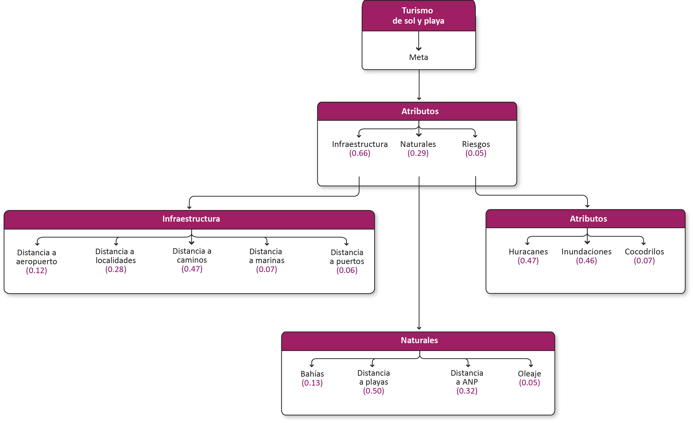
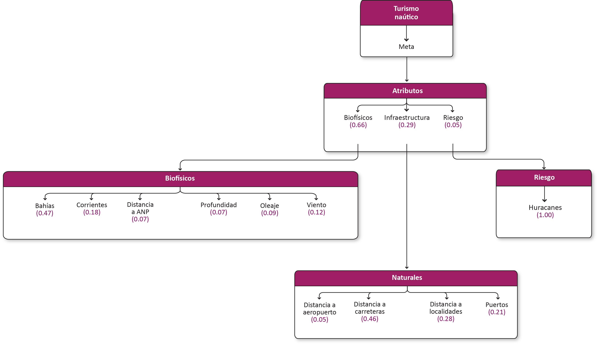

# Turismo. Avances preliminares

<!-- Ruta de la documentación:
PACA\diagno\aptitud\web\PACA\docs\source -->

[Lista de participantes](https://www.dropbox.com/scl/fi/38sqhcfpddx2228w2eq7b/lista_asistencia.pdf?rlkey=jfzdnxf2c7tqtnn9ku5cm1ypm&st=w8ef4xs8&dl=0)

## 1. Turismo de sol y playa

## Meta

Promover un desarrollo armónico y sustentable de la infraestructura inmobiliaria y hotelera, así como de la prestación de servicios turísticos en tierra y mar, en un entorno seguro que reconozca y respete la vocación local de cada destino, con el objetivo de potenciar el bienestar y el desarrollo integral de las comunidades costeras de la región.

### 1.1 Modelo de decisión

### 1.2 Atributos

#### 1.2.1 

**Insumos**

**Parámetros de la función de valor**

**Función de valor de zonas de recarga**

## 2. Turismo naútico 

## Meta

Aprovechar y conservar los atractivos naturales de la región y contribuir al desarrollo de las comunidades costeras a través del consumo de bienes y servicios locales. 
Incrementar las instalaciones para la prestación de servicios (marinas, atracaderos, astilleros y botadores) para el turismo náutico en embarcaciones privadas.

### 2.1 Modelo de decisión

### 2.2 Atributos

## 3. Turismo de crucero

## Meta

Construir terminales para la recepción de cruceros en puertos industriales de la región que no cuentan con esta infraestructura. 
Promover la visita de sitios de interés turístico cercanos al puerto.
